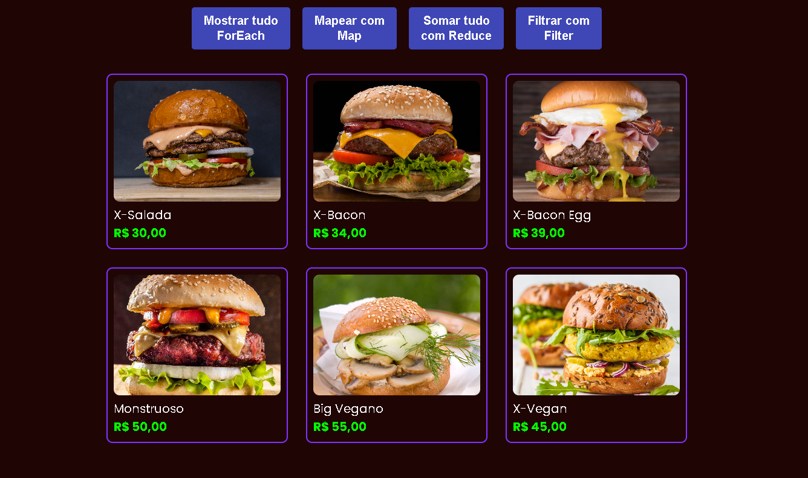

<h1 align="center">🍔 Fred Burguer - JavaScript Array Methods</h1>

  Projeto focado no domínio prático dos principais métodos de manipulação de Arrays no JavaScript: <strong>forEach</strong>, <strong>map</strong>, <strong>reduce</strong> e <strong>filter</strong>.

## 💻 Sobre o Projeto

O **Fred Burguer** simula um sistema de cardápio de uma hamburgueria. O usuário pode interagir com os botões na tela para aplicar tratamentos diferentes na lista de produtos exibidos (como dar descontos, filtrar veganos e somar tudo).

Esta aplicação é excelente para entender o funcionamento do DOM em conjunto com os métodos mais poderosos da linguagem JavaScript.

## 🚀 Funcionalidades Implementadas

- **Mostrar Tudo (`forEach`)**: Exibe a lista completa de hambúrgueres no HTML iterando sobre os dados brutos.
- **Mapear Tudo (`map`)**: Aplica 10% de desconto no valor de todos os itens e constrói o cardápio com os novos preços.
- **Filtrar Seleção (`filter`)**: Permite criar um filtro rápido e limpo para mostrar apenas os pratos veganos aos clientes.
- **Somar Total (`reduce`)**: Processa e reduz a lista inteira de valores em apenas um número, apresentando instantaneamente o valor total do cardápio.

## 🛠️ Tecnologias Utilizadas

- **HTML5**: Estruturação semântica
- **CSS3**: Layout e identidade visual
- **JavaScript Moderno**: Toda a mágica e lógica da aplicação

## 📸 Preview

  

## 🏃 Como testar o projeto

1. Faça o clone ou o download deste repositório.
2. Dê um duplo-clique no arquivo `index.html` ou abra pelo **Live Server** do VS Code.
3. Teste os botões e veja o JavaScript trabalhando!

---
> Projeto construído como forma de evolução contínua no Front-End! 🚀
